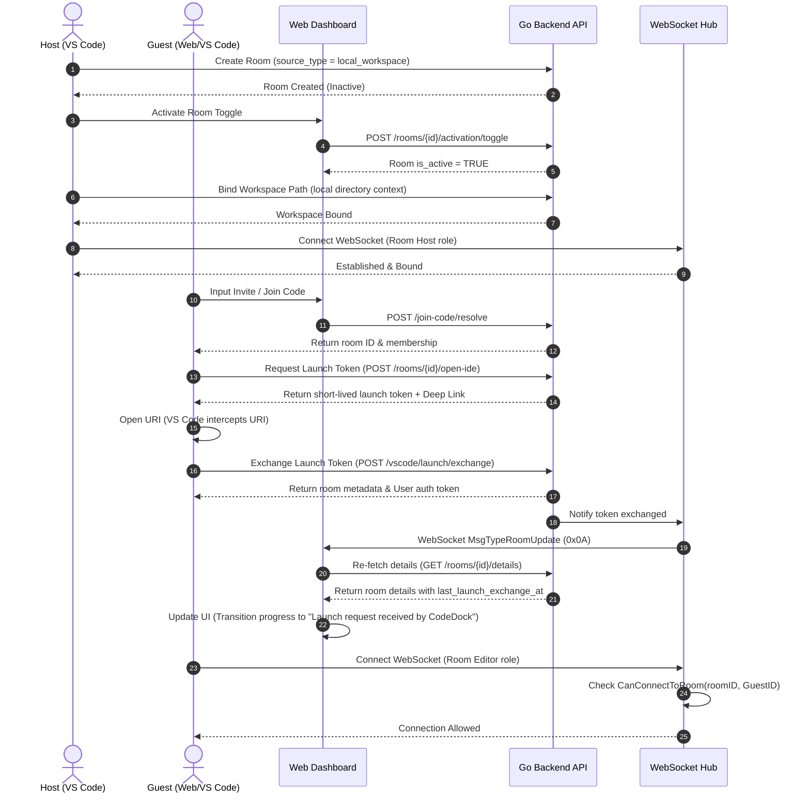
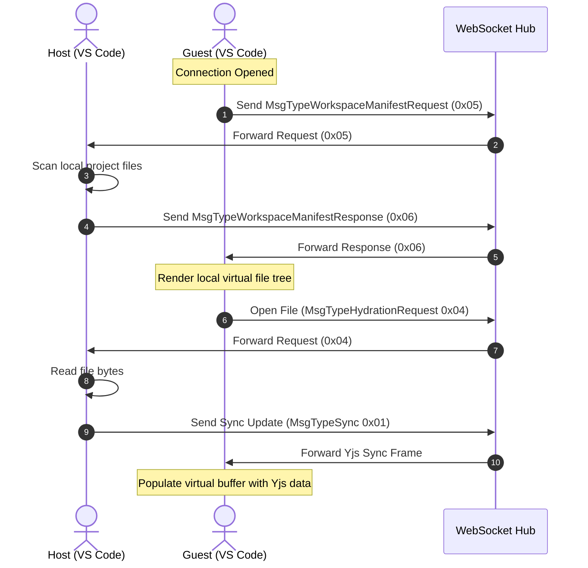

# CodeDock Architecture & System Index

This document provides a comprehensive structural mapping and architectural index of the CodeDock workspace. It outlines the codebase layout, key systems, data models, network protocols, and integration flows to serve as a reference for maintenance, security reviews, and future feature implementations.

**Last indexed:** 2026-06-10

---

## 1. System & Tech Stack Overview

CodeDock is a self-hosted, collaborative Pair-Programming control plane and real-time syncing environment. It connects a web-based dashboard (control plane) to local VS Code (or future Antigravity) environments, enabling synchronized code editing, awareness, and remote guest participation.

*   **Go Backend Service (v1.25):** Core service handling REST API endpoints (Auth, Rooms, Invites, Launch Tokens), database queries, and raw WebSocket concurrency.
*   **Web Frontend (Next.js 16, React 19, TS):** The dashboard interface for room lifecycle management, guest access coordination, invite code configuration, and active workspace tracking.
*   **VS Code Extension v3.2.0 (TS):** The client-side IDE agent that materializes collaborative workspaces locally, manages Yjs document synchronizations, maps user cursor positions/selections, and channels workspace state back to the backend.
*   **Database (PostgreSQL 16):** Houses user accounts, active rooms, membership access lists, invite token histories, launch states, and file activity logs.
*   **Sync Protocol (Yjs/CRDT over WebSocket):** Enables conflict-free collaborative editing over standard `net/http` and `gorilla/websocket` channels using a custom binary frame structure.

---

## 2. Directory Structure Mapping

```
/
├── main.go                       # Go server entrypoint, route handlers, and middleware assembly
├── go.mod                        # Go module definition and dependencies (gorilla/websocket, golang-jwt/jwt, sentry-go, lib/pq)
├── Dockerfile                    # Multi-stage Go build (golang:1.25-alpine → alpine:latest)
├── fly.toml                      # Fly.io deployment config (fra region, 1GB RAM, auto-start)
├── internal/                     # Server internal logic
│   ├── auth/                     # JWT generation, token validation, claim extraction, auth middleware
│   │   ├── jwt.go                # GenerateToken, ValidateToken, extractClaims
│   │   ├── jwt_test.go           # JWT token lifecycle tests
│   │   └── middleware.go         # RequireAuth HTTP middleware
│   ├── handlers/                 # HTTP controller handlers
│   │   ├── auth.go               # Register, Login, Me, ExchangeCode (deprecated)
│   │   ├── rooms.go              # RoomsRouter, RoomSpecificRouter, GetRoomDetails, GetRoomPresence, ToggleRoomActivation, BindLocalWorkspace, LeaveRoom, GetRoomActivities
│   │   ├── invites.go            # ResolveJoinCode, ListRoomInvites, CreateRoomInvite, RevokeRoomInvite
│   │   ├── launch.go             # OpenInVSCode, OpenIDE, ExchangeLaunchToken
│   │   ├── ws.go                 # ServeWS — WebSocket upgrade, origin validation, hub registration
│   │   ├── health.go             # Health (liveness), Ready (readiness + DB ping)
│   │   └── integration_test.go   # End-to-end handler integration tests
│   ├── hub/                      # WebSocket Hub coordinating room state, persistence, and signaling
│   │   ├── hub.go                # Hub struct, Run loop, Register/Unregister, Broadcast, room-scoped relay
│   │   ├── client.go             # Client struct (conn, roomID, userID, role), ReadPump, WritePump
│   │   ├── message.go            # Message type constants (0x01–0x0B), Message struct
│   │   └── hub_test.go           # Hub concurrency and message routing tests
│   ├── middleware/               # HTTP middleware
│   │   └── rate.go               # Token-bucket rate limiter (configurable burst/window)
│   ├── observability/            # Error tracking
│   │   └── sentry.go             # InitSentry, CaptureError, flush helpers
│   └── services/                 # Core domain service implementations
│       ├── rooms.go              # RoomService — CRUD, GetRoomDetails, GetRoomPresence, ToggleActivation, MarkLocalWorkspaceBound, buildRoomSourceState, slug/join-code generation
│       ├── invite.go             # InviteService — Create (5-min expiry, revoke-previous), Validate, List, Revoke
│       ├── launch.go             # LaunchService — GenerateLaunchToken (2-min TTL), ExchangeLaunchToken
│       ├── snapshots.go          # DBSnapshotStore — Yjs CRDT state persistence
│       ├── activities.go         # DBActivityStore — user activity logging (edits, joins, leaves)
│       ├── users.go              # CreateUser helper (bcrypt hashing, DB insert)
│       ├── invite_test.go        # Invite service unit tests
│       ├── room_service_test.go  # Room service unit tests
│       ├── snapshot_test.go      # Snapshot store tests
│       ├── users_test.go         # User creation tests
│       └── testmain_test.go      # Test suite setup (test DB connection)
├── migration/                    # Ordered PostgreSQL migration scripts
│   ├── 001_create_extensions.sql     # Enable pgcrypto
│   ├── 002_create_enums.sql          # Room role enums (editor, viewer)
│   ├── 003_create_users.sql          # Users table
│   ├── 004_create_trigger_function.sql # Auto-update updated_at trigger
│   ├── 005_create_rooms.sql          # Rooms table
│   ├── 006_create_room_members.sql   # Room membership table
│   ├── 007_create_snapshots.sql      # Yjs document snapshot table
│   ├── 008_create_invite_tokens.sql  # Invite tokens table
│   ├── 009_create_activities.sql     # Activity audit log table
│   ├── 012_default_rooms_inactive.sql # Default rooms to inactive
│   └── 0002_phase1_control_plane.sql  # Phase 1 control plane (launch tokens, source metadata)
├── extension/                    # VS Code extension codebase (v3.2.0)
│   ├── src/
│   │   ├── extension.ts          # Extension activator, URI deep-link routers, workspace launchers, command registration
│   │   ├── api.ts                # REST API client mapping CodeDock backend endpoints
│   │   ├── auth.ts               # Local credentials store (VS Code SecretStorage) and credential prompts
│   │   ├── chat.ts               # Webview chat panel backend provider
│   │   ├── cursor-manager.ts     # Visual cursor and selection range tracking across active editors
│   │   ├── git.ts                # Git operations and local repository state synchronization
│   │   ├── websocket.ts          # Custom reconnecting WebSocket client with queue, state transitions
│   │   ├── protocol.ts           # Binary encoding/decoding layers for sync, awareness, and activity frames
│   │   ├── yjs-sync.ts           # Yjs bindings, workspace materialization, file tree sync handlers
│   │   ├── status-bar.ts         # Theme-aware, stateful status indicator singleton (connected/disconnected/issue)
│   │   ├── types.ts              # TypeScript definitions for the extension domain
│   │   ├── utils.ts              # Helper functions and path normalization utilities
│   │   └── test/
│   │       └── cursor-manager.spec.ts  # Cursor manager unit tests
│   ├── package.json              # Extension metadata (v3.2.0), VS Code commands (9), configuration settings
│   ├── esbuild.js                # Bundle configuration
│   ├── tsconfig.json             # TypeScript compiler config
│   ├── images/                   # Extension marketplace assets
│   └── *.vsix                    # Pre-built extension packages (v2.8.0, v3.0.0, v3.1.0, v3.2.0)
└── codedock-web/                 # Next.js App-Router control plane
    ├── app/
    │   ├── layout.tsx            # Root layout (Providers, Vercel Analytics/SpeedInsights, favicon, preloads)
    │   ├── page.tsx              # Landing page (marketing, TextRotate, auto-redirect if authenticated)
    │   ├── globals.css           # Global styles
    │   ├── (auth)/               # Auth route group
    │   │   ├── layout.tsx        # Auth layout wrapper
    │   │   ├── login/page.tsx    # Login page
    │   │   └── register/page.tsx # Register page
    │   └── (app)/                # Protected route group (AuthGuard + AppShell)
    │       ├── layout.tsx        # AuthGuard → AppShell wrapper
    │       ├── dashboard/page.tsx     # Room dashboard
    │       ├── activity/page.tsx      # Session activity timeline
    │       ├── join/page.tsx          # Join room via code
    │       └── rooms/
    │           ├── new/page.tsx       # Create new room
    │           └── [roomId]/
    │               ├── page.tsx       # Room details (client-side via room-details-page component)
    │               └── review/[userId]/page.tsx  # Code review for specific user
    ├── components/
    │   ├── app-shell.tsx         # App chrome (header + content area)
    │   ├── auth/                 # Auth components
    │   │   ├── auth-guard.tsx    # Route protection (redirect to /login if unauthenticated)
    │   │   ├── auth-shell.tsx    # Auth page layout (centered card)
    │   │   ├── login-form.tsx    # Login form with validation
    │   │   └── register-form.tsx # Registration form with validation
    │   ├── dashboard/            # Dashboard components
    │   │   ├── room-list.tsx     # Room listing with loading/empty states
    │   │   ├── room-card.tsx     # Individual room preview card
    │   │   └── join-code-form.tsx # Quick join-code entry form
    │   ├── rooms/                # Room detail components
    │   │   ├── room-details-page.tsx     # Full room details orchestrator
    │   │   ├── room-details-skeleton.tsx # Loading skeleton
    │   │   ├── room-header.tsx          # Room title, status, actions bar
    │   │   ├── room-source-badge.tsx    # Source type indicator badge
    │   │   ├── source-state-card.tsx    # Workspace readiness state card
    │   │   ├── presence-card.tsx        # Online members, connection status
    │   │   ├── member-details-modal.tsx # Member activity details modal
    │   │   ├── invite-create-form.tsx   # Generate invite token form
    │   │   ├── invite-list.tsx          # Active/expired invite listing
    │   │   ├── open-ide-button.tsx      # IDE-agnostic launch button (VS Code / Antigravity)
    │   │   ├── open-in-vscode-button.tsx # VS Code-specific launch button
    │   │   ├── create-room-form.tsx     # Room creation form
    │   │   ├── join-room-form.tsx       # Join room via invite code
    │   │   ├── delete-room-button.tsx   # Room deletion with confirmation
    │   │   ├── leave-room-button.tsx    # Leave room action
    │   │   ├── activity-timeline-card.tsx # Activity feed card
    │   │   └── code-review-page.tsx     # Side-by-side diff review interface
    │   ├── layout/
    │   │   └── app-header.tsx    # Navigation header with user menu
    │   ├── marketing/
    │   │   └── marketing-shell.tsx # Landing page layout (SilkHero background, nav)
    │   ├── brand/
    │   │   └── logo.tsx          # CodeDock SVG logo
    │   ├── backgrounds/
    │   │   └── silk-hero.tsx     # Animated silk gradient hero background
    │   ├── fancy/
    │   │   └── text/
    │   │       └── text-rotate.tsx # Rotating text animation component
    │   ├── reactbits/
    │   │   └── silk.tsx          # WebGL silk effect rendering
    │   └── ui/                   # Reusable UI primitives
    │       ├── button.tsx        # Button with variants (primary, secondary, ghost, destructive)
    │       ├── input.tsx         # Styled text input
    │       ├── label.tsx         # Form label
    │       ├── card.tsx          # Card container
    │       ├── badge.tsx         # Status badge
    │       ├── skeleton.tsx      # Loading skeleton
    │       ├── spinner.tsx       # Loading spinner
    │       ├── loading-state.tsx # Full loading state with message
    │       ├── link-button.tsx   # Button-styled link
    │       ├── toast.tsx         # Sonner toast integration
    │       ├── code-block.tsx    # Syntax-highlighted code block (react-syntax-highlighter)
    │       ├── diff-view.tsx     # Unified/split diff viewer
    │       ├── error-boundary.tsx # React error boundary with fallback
    │       └── providers.tsx     # TanStack Query provider wrapper
    ├── hooks/                    # React hooks (data fetching + state)
    │   ├── use-auth.ts           # Auth state, login/logout, token management (localStorage)
    │   ├── use-room.ts           # Fetch/update single room
    │   ├── use-rooms.ts          # Fetch user's room list
    │   ├── use-room-details.ts   # Extended room metadata (source state, membership)
    │   ├── use-room-sync.ts      # WebSocket sync state + MsgTypeRoomUpdate listener
    │   ├── use-room-presence.ts  # Online users, cursor positions
    │   ├── use-room-activities.ts # Activity audit log
    │   ├── use-invites.ts        # List, create, revoke room invites
    │   ├── use-join-code.ts      # Resolve join codes to rooms
    │   ├── use-launch.ts         # Generate/exchange launch tokens
    │   ├── use-review-files.ts   # File diff generation and review state
    │   └── use-error-handler.ts  # Centralized error normalization
    ├── lib/
    │   ├── api/                  # API client layer
    │   │   ├── client.ts         # Base fetch wrapper (auth headers, error handling)
    │   │   ├── auth.ts           # Auth API functions (register, login, me)
    │   │   ├── rooms.ts          # Room API functions (CRUD, details, presence, activities, activation, bind)
    │   │   ├── invites.ts        # Invite API functions (resolve, list, create, revoke)
    │   │   └── launch.ts         # Launch API functions (open-ide, exchange)
    │   ├── config/
    │   │   └── env.ts            # NEXT_PUBLIC_API_BASE_URL config
    │   ├── diff/                 # Diff computation utilities
    │   │   ├── compute-diff.ts   # Core diff algorithm wrapper
    │   │   ├── css-diff.ts       # CSS-aware diff rendering
    │   │   ├── diff-strategy.ts  # Diff strategy selection
    │   │   └── diff.test.ts      # Diff computation tests
    │   ├── utils/                # Utility functions
    │   │   ├── editor-launch.ts  # IDE deep-link URL construction
    │   │   ├── format.ts         # Date/time formatting helpers
    │   │   ├── slug.ts           # Client-side slug utilities
    │   │   └── storage.ts        # localStorage wrapper
    │   └── utils.ts              # General utility exports
    ├── types/                    # Frontend TypeScript types
    │   ├── room.ts               # Room, RoomDetails, RoomSourceState, RoomPresence types
    │   ├── auth.ts               # User, AuthState types
    │   ├── invite.ts             # InviteToken types
    │   ├── launch.ts             # LaunchToken, DeepLink types
    │   ├── review.ts             # ReviewFile, DiffResult types
    │   ├── api.ts                # API response wrapper types
    │   └── postcss-less.d.ts     # PostCSS module declaration
    ├── public/
    │   ├── favicon.png           # App favicon
    │   └── brand/                # Brand assets
    ├── package.json              # Next.js 16, React 19, TanStack Query 5, Tailwind CSS 3.4, Sonner, Lucide, Vitest
    ├── tailwind.config.ts        # Tailwind theming
    ├── next.config.ts            # Next.js config (webpack, env)
    └── tsconfig.json             # TypeScript config (path aliases @/*)
```

---

## 3. Database Schema & Migrations

The storage layer relies on ordered PostgreSQL migrations matching the files in `migration/`. Key tables include:

```mermaid
erDiagram
    users ||--o{ rooms : "created_by"
    users ||--o{ room_members : "participates"
    users ||--o{ room_invite_tokens : "creates"
    users ||--o{ room_launch_tokens : "launches"
    rooms ||--o{ room_members : "has"
    rooms ||--o{ room_invite_tokens : "has"
    rooms ||--o{ room_launch_tokens : "has"
    rooms ||--o{ snapshots : "stores"
    rooms ||--o{ activities : "logs"

    users {
        uuid id PK
        string email UNIQUE
        string password_hash
        timestamp created_at
    }

    rooms {
        uuid id PK
        string name
        string slug UNIQUE
        uuid owner_user_id FK
        string source_type
        jsonb source_metadata
        string primary_join_code UNIQUE
        boolean is_active
        timestamp created_at
        timestamp updated_at
    }

    room_members {
        uuid room_id PK, FK
        uuid user_id PK, FK
        string role "host or editor"
        timestamp joined_at
    }

    room_invite_tokens {
        uuid id PK
        uuid room_id FK
        string code UNIQUE
        uuid created_by_user_id FK
        timestamp expires_at
        integer max_uses
        integer uses_count
        boolean is_revoked
        timestamp created_at
    }

    room_launch_tokens {
        uuid id PK
        uuid room_id FK
        uuid user_id FK
        string intended_role
        string token_hash UNIQUE
        timestamp expires_at
        timestamp used_at
        timestamp created_at
    }

    snapshots {
        uuid id PK
        uuid room_id FK
        string file_path
        bytea yjs_state
        timestamp updated_at
    }

    activities {
        uuid id PK
        uuid room_id FK
        uuid user_id FK
        string type
        string file_path
        jsonb details
        timestamp created_at
    }
```

---

## 4. Key Collaboration Protocols

Collaborating clients and backend nodes exchange binary frames over WebSockets. Each frame starts with a **1-byte message type identifier**:

| Type Code | Message Type | Payload Structure | Purpose |
| :--- | :--- | :--- | :--- |
| `0x01` | `SYNC` | `[1-byte Type] [2-byte PathLength] [FilePath] [Yjs Update]` | Updates a file state using Yjs CRDT differential arrays. |
| `0x02` | `AWARENESS` | `[1-byte Type] [JSON String]` | User identity, cursor coordinates, and selected text ranges. |
| `0x03` | `CHAT` | `[1-byte Type] [JSON String]` | Chat message strings between connected users. |
| `0x04` | `HYDRATION_REQUEST` | `[1-byte Type] [2-byte PathLength] [FilePath]` | Sent by guest to request the full text content of a file. |
| `0x05` | `WORKSPACE_MANIFEST_REQUEST` | `[1-byte Type] [JSON String]` | Sent by guest to obtain the file tree hierarchy from the host. |
| `0x06` | `WORKSPACE_MANIFEST_RESPONSE` | `[1-byte Type] [JSON String]` | Sent by host representing the folder schema (paths, kind, sizes). |
| `0x07` | `FILE_BOOTSTRAP_REQUEST` | `[1-byte Type] [JSON String]` | Sent by guest asking for bootstrap file payload. |
| `0x08` | `FILE_BOOTSTRAP_RESPONSE` | `[1-byte Type] [JSON String]` | Sent by host to send bootstrap code contents. |
| `0x09` | `FILE_ACTIVITY` | `[1-byte Type] [JSON String]` | Full file path and content snapshots used for logging/persistence. |
| `0x0A` | `ROOM_UPDATE` | `[1-byte Type]` | Broadcast by the backend to signal web/IDE clients to re-fetch room details. |
| `0x0B` | `FILE_ACTIVITY_INCREMENTAL` | `[1-byte Type] [JSON String]` | Incremental edits (index offset, deleted count, insert contents). |

---

## 5. Security & Expiration Policies

CodeDock implements several security mechanisms to ensure that code remains within the ownership boundary:

1.  **Strict Token-Based Invite Lifecycle:**
    *   Invite tokens generated for a room default to a strict **5-minute expiration window** (`expires_at = created_at + 5 minutes`).
    *   Generating a new room invite token immediately revokes all prior tokens for that room (`is_revoked = TRUE`), maintaining a strict single-active-token security model.
2.  **Gated Guest Connectivity:**
    *   Guests cannot establish a WebSocket connection or access workspace code if the room is marked as inactive (`is_active = FALSE`).
    *   Hosts control the room's activation state via a dashboard toggle (`/rooms/{id}/activation/toggle`). Guests attempting to connect to an inactive room receive an `ErrRoomNotActivated` rejection.
3.  **One-Time IDE Launch Tokens:**
    *   Deep-link launches (`vscode://jerryjuche.codedock/...` or `antigravity://...`) require a one-time launch token (`room_launch_tokens`).
    *   Launch tokens carry a short-term TTL (2 minutes) and are immediately consumed upon exchange (`used_at IS NOT NULL`), preventing link reuse or interception.
4.  **Path Traversal Prevention:**
    *   The IDE extension validates that the workspace room slug matching the metadata format `^[a-z0-9-]+$` contains no traversal properties prior to directory creation.

---

## 6. Execution Flow Diagrams

### Room Setup & Guest Join Flow


### Yjs Synchronization & Hydration Loop


---

## 7. Configuration & Environment Reference

The Go backend and web application are configured through environment variables.

### Backend Configurations (Root `.env`)
*   `JWT_SECRET`: Used to generate and sign authorization tokens. Must be kept secret.
*   `DB_HOST` / `DB_PORT` / `DB_USER` / `DB_PASSWORD` / `DB_NAME`: Database credentials.
*   `DB_SSLMODE`: SSL verification mode for PostgreSQL (e.g., `require` or `disable`).
*   `PORT`: Port the HTTP/WebSocket server listens on (defaults to `8080`).
*   `WEB_ALLOWED_ORIGINS`: Comma-separated list of browser origins permitted to contact the backend (CORS protection). Wildcards are rejected.
*   `SENTRY_DSN`: Observability instrumentation integration URL (Optional).

### Web App Configurations (`codedock-web/.env`)
*   `NEXT_PUBLIC_API_BASE_URL`: Base URL pointing to the active Go backend instance (e.g. `http://localhost:8080` or `https://codedock.fly.dev`).

### Extension Configurations (`extension/package.json` → `contributes.configuration`)
*   `codedock.serverUrl`: Base URL of the CodeDock backend server (default: `https://codedock.fly.dev`).
*   `codedock.webAppUrl`: URL of the CodeDock web app (default: `https://codedockapp.vercel.app/`).

---

## 8. API Endpoints Reference

### Authentication
| Method | Path | Auth | Rate Limited | Description |
|--------|------|------|-------------|-------------|
| `POST` | `/auth/register` | No | Yes | Create account |
| `POST` | `/auth/login` | No | Yes | JWT token generation |
| `GET` | `/auth/me` | JWT | No | Fetch authenticated user |
| `POST` | `/auth/exchange` | No | No | **Deprecated** — legacy code exchange |

### Rooms
| Method | Path | Auth | Description |
|--------|------|------|-------------|
| `GET` | `/rooms` | JWT | List user's rooms |
| `POST` | `/rooms` | JWT | Create room |
| `GET` | `/rooms/{roomId}` | JWT | Get room |
| `DELETE` | `/rooms/{roomId}` | JWT | Soft-delete room (host only) |
| `GET` | `/rooms/{roomId}/details` | JWT | Extended room metadata with source state |
| `GET` | `/rooms/{roomId}/presence` | JWT | Online users, connection status |
| `GET` | `/rooms/{roomId}/activities` | JWT | Activity audit log |
| `POST` | `/rooms/{roomId}/activation/toggle` | JWT | Activate/deactivate room (owner only) |
| `POST` | `/rooms/{roomId}/source/local/bind` | JWT | Bind local workspace (host only) |
| `POST` | `/rooms/{roomId}/leave` | JWT | Leave room as member |

### Invites
| Method | Path | Auth | Description |
|--------|------|------|-------------|
| `POST` | `/join-code/resolve` | JWT + RL | Resolve invite code → room |
| `GET` | `/rooms/{roomId}/invites` | JWT | List room invites |
| `POST` | `/rooms/{roomId}/invites` | JWT | Generate invite (5-min expiry, revokes previous) |
| `DELETE` | `/rooms/{roomId}/invites/{inviteId}/revoke` | JWT | Revoke invite |

### IDE Launch
| Method | Path | Auth | Description |
|--------|------|------|-------------|
| `POST` | `/rooms/{roomId}/open-in-vscode` | JWT | Generate VS Code launch token + deep-link |
| `POST` | `/rooms/{roomId}/open-ide` | JWT | Generate IDE-agnostic launch token |
| `POST` | `/vscode/launch/exchange` | No | Exchange launch token for room context + auth |

### Infrastructure
| Method | Path | Description |
|--------|------|-------------|
| `GET` | `/health` | Liveness probe |
| `GET` | `/ready` | Readiness probe (includes DB ping) |
| `GET` | `/ws` | WebSocket upgrade (rate limited, origin validated) |

---

## 9. VS Code Extension Commands

| Command ID | Title | Description |
|-----------|-------|-------------|
| `codedock.login` | Login | Authenticate with CodeDock backend |
| `codedock.logout` | Logout | Clear stored credentials |
| `codedock.joinRoom` | Join Room | Join a collaboration room |
| `codedock.createRoom` | Create Room | Create a new room from current workspace |
| `codedock.openChat` | Open Chat | Open the integrated chat panel |
| `codedock.disconnectRoom` | Disconnect from Room | Leave active collaboration session |
| `codedock.showMenu` | Show Actions | Quick-action picker menu |
| `codedock.openWebApp` | Open Web App | Open CodeDock dashboard in browser |
| `codedock.openLogs` | Show Logs | Open extension output channel |
